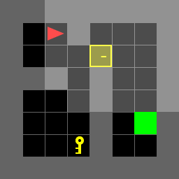
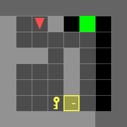
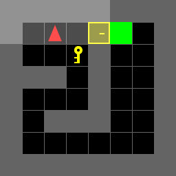
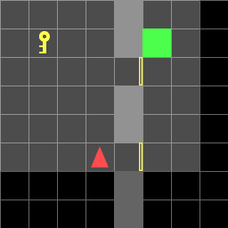
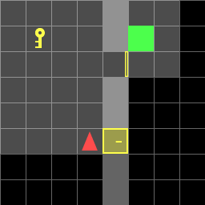
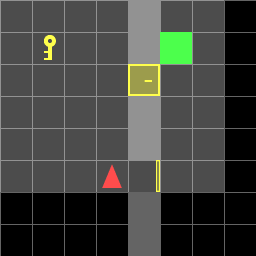
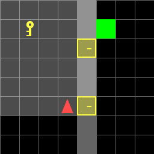
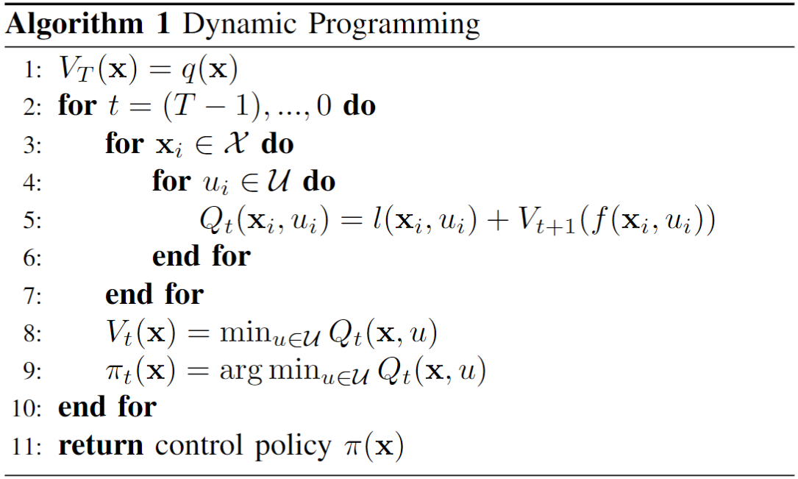

# Finite-Time Optimal Control

# Overview
This project utilizes Dynamic Programming to solve the Finite-Time Optimal Control problem to provide an optimal control policy for an agent to navigate its way through an environment to reach the goal point.

# Implementation
This was implemented in Python using NumPy and Gymnasium. The code has been redacted, if you wish to see it, you may contact me at charles.lychee@gmail.com

# Results
## Known Environment
We describe our "Known" environments as problems where we know our exact environment prior to computing our optimal control policy for each environment. e.g. 3 environments get 3 different control policies.







## Random Environment
We describe our "Random" environments as problems where we do not know our exact environment, but are given a basic structure of the environment. e.g. 2 doors with same coordinate across all random environments.

We compute one control policy that is generalized to the basic structure of our random environment. e.g. 3 environments get 1 control policy.









# Mathematical Approach
## Known Map
### State Space
```math
\begin{split}
    \mathcal{X} &= \left\{\mathbf{x} = \begin{pmatrix}
        \bar{x}\\
        \bar{y}\\
        o\\
        k\\
        d
    \end{pmatrix}= \begin{pmatrix}
        \text{x-position}\\
        \text{y-position}\\
        \text{orientation}\\
        \text{picked up key}\\
        \text{door unlocked}
    \end{pmatrix}\in \mathbb{R}^5
    \right\}\\
    s.t.\, &0 \leq \bar{x} < W = \text{map width} \\
        &0 \leq \bar{y} < H = \text{map height}\\
        &o \in \{\text{RIGHT}, \text{DOWN}, \text{LEFT}, \text{UP}\} = \{0, 1, 2, 3\}\\
        &k \in \{0, 1\}\\
        &d \in \{0, 1\}
\end{split}
```

### Control Space
```math
$$\begin{split}
    \mathcal{U} &= \left\{\text{MF}, \text{TL}, \text{TR}, \text{PK}, \text{UD}\right\} \\
    \text{s.t. MF}&: \text{Move Forward} \\
    \text{TL}&: \text{Turn Left} \\
    \text{TR}&: \text{Turn Right} \\
    \text{PK}&: \text{Pick up Key} \\
    \text{UD}&: \text{Unlock Door} 
\end{split}$$
```

## Motion Model
```math
$$\begin{split}
    \mathbf{x}_{t+1} &= f(\mathbf{x}_t, u_t) \\
    &= \begin{cases}
        \bar{x}_{t+1} = \bar{x}_t + 1 : o_t = \text{RIGHT}, u_t = \text{MF}\\
        \bar{x}_{t+1} = \bar{x}_t - 1 : o_t = \text{LEFT}, u_t = \text{MF}\\
        \bar{y}_{t+1} = \bar{y}_t + 1 : o_t = \text{DOWN}, u_t = \text{MF}\\
        \bar{y}_{t+1} = \bar{y}_t - 1 : o_t = \text{UP}, u_t = \text{MF}\\
        o_{t+1} = (o_t + 1) \mod 4 : u_t = \text{TR}\\
        o_{t+1} = (o_t - 1) \mod 4 : u_t = \text{TL}\\
        k_{t+1} = 1 : u_t = \text{PK}\\
        d_{t+1} =  1 : u_t = \text{UD}\\
        \mathbf{x}_t : \text{otherwise}
    \end{cases}
\end{split}$$
```

## Planning Horizon
The planning horizon is chosen to be the total number of states:
$$T = (W \times H \times 4 \times 2 \times 2) - 1$$

## Cost Functions
For the purposes of making the upcoming definitions easier, we define the state of the agent taking a step in front of it as
```math
\hat{\mathbf{x}} = f(\mathbf{x},\text{MF}) = \begin{pmatrix}
        \hat{\bar{x}}\\
        \hat{\bar{y}}\\
        \hat{o}\\
        \hat{k}\\
        \hat{d}
    \end{pmatrix}
```

### Stage Cost
```math
l(\mathbf{x}, u) = \begin{cases}
        0 : (\bar{x}, \bar{y}) = p_\text{goal}, u \neq \text{MF}\\
        \infty : (\bar{x}, \bar{y}) \in \text{Walls}\\
        \infty : (\bar{x}, \bar{y}) = p_\text{door}, d = 0\\
        \infty : (\bar{x}, \bar{y}) = p_\text{key}, k = 0\\
        \infty : \hat{\bar{x}} \notin [0,W), \hat{\bar{y}} \notin [0,H)\\
        \infty : (\hat{\bar{x}}, \hat{\bar{y}}) = p_\text{key}, u = \text{PK}\\
        \infty : (\hat{\bar{x}}, \hat{\bar{y}}) = p_\text{door}, u = \text{UD}\\
        \infty : k=0, u = \text{UD}\\
        1 : \text{otherwise}
    \end{cases}
```

### Terminal Cost
```math
q(\mathbf{x}) = \begin{cases}
        0 : \bar{x} = \bar{x}_\text{goal}, \bar{y} = \bar{y}_\text{goal}\\
        \infty : \text{otherwise}
    \end{cases}
```

## Random Map
### State Space
In the Random Map problem, we need to expand our state space to include the 2 doors' states, the position of the key, and the position of goal
```math
\begin{split}
    \mathcal{X} &= \left\{\mathbf{x} = \begin{pmatrix}
        \bar{x}\\
        \bar{y}\\
        o\\
        k\\
        d_1\\
        d_2\\
        p_{\text{key}}\\
        p_{\text{goal}}
    \end{pmatrix}= \begin{pmatrix}
        \text{x-position}\\
        \text{y-position}\\
        \text{orientation}\\
        \text{picked up key}\\
        \text{door 1 unlocked}\\
        \text{door 2 unlocked}\\
        \text{position index of key}\\
        \text{position index of goal}
    \end{pmatrix}\in \mathbb{R}^8
    \right\}\\
    s.t.\, &0 \leq \bar{x} < W = \text{map width} \\
        &0 \leq \bar{y} < H = \text{map height}\\
        &o \in \{\text{RIGHT}, \text{DOWN}, \text{LEFT}, \text{UP}\} = \{0, 1, 2, 3\}\\
        &k \in \{0, 1\}\\
        &d_1 \in \{0, 1\}\\
        &d_2 \in \{0, 1\}\\
        &p_{\text{key}} \in \{0, 1, 2\}\\
        &p_{\text{goal}} \in \{0,1,2\}\\
        &\text{KeyPos} = [(1,1),(2,3),(1,6)]\\
        &\text{GoalPos} = [(5,1),(6,3),(5,6)]
    \end{split}
```

### Control Space
```math
\begin{split}
    \mathcal{U} &= \left\{\text{MF}, \text{TL}, \text{TR}, \text{PK}, \text{UD}\right\} \\
    \text{s.t. MF}&: \text{Move Forward} \\
    \text{TL}&: \text{Turn Left} \\
    \text{TR}&: \text{Turn Right} \\
    \text{PK}&: \text{Pick up Key} \\
    \text{UD}&: \text{Unlock Door} 
\end{split}
```

### Motion Model
```math
\begin{split}
    \mathbf{x}_{t+1} &= f(\mathbf{x}_t, u_t) \\
    &= \begin{cases}
        \bar{x}_{t+1} = \bar{x}_t + 1 : o_t = \text{RIGHT}, u_t = \text{MF}\\
        \bar{x}_{t+1} = \bar{x}_t - 1 : o_t = \text{LEFT}, u_t = \text{MF}\\
        \bar{y}_{t+1} = \bar{y}_t + 1 : o_t = \text{DOWN}, u_t = \text{MF}\\
        \bar{y}_{t+1} = \bar{y}_t - 1 : o_t = \text{UP}, u_t = \text{MF}\\
        o_{t+1} = (o_t + 1) \mod 4 : u_t = \text{TR}\\
        o_{t+1} = (o_t - 1) \mod 4 : u_t = \text{TL}\\
        k_{t+1} = 1 : u_t = \text{PK}\\
        d_{1,t+1} =  1 : (\hat{\bar{x}},\hat{\bar{y}}) = p_\text{door1}, u_t = \text{UD}\\
        d_{2,t+1} =  1 : (\hat{\bar{x}},\hat{\bar{y}}) = p_\text{door2}, u_t = \text{UD}\\
        \mathbf{x}_t : \text{otherwise}
    \end{cases}
    \end{split}
```

### Planning Horizon
$$T = (W \times H \times 4 \times 2 \times 2 \times 2 \times 3 \times 3) - 1$$

### Cost Functions
#### Stage Cost
```math
l(\mathbf{x}, u) = \begin{cases}
        0 : (\bar{x}, \bar{y}) = p_\text{goal}, u \neq \text{MF}\\
        \infty : (\bar{x}, \bar{y}) \in \text{Walls}\\
        \infty : (\bar{x}, \bar{y}) = p_\text{door1}, d_1 = 0\\
        \infty : (\bar{x}, \bar{y}) = p_\text{door2}, d_2 = 0\\
        \infty : (\bar{x}, \bar{y}) = p_\text{key}, k = 0\\
        \infty : \hat{\bar{x}} \notin [0,W), \hat{\bar{y}} \notin [0,H)\\
        \infty : (\hat{\bar{x}}, \hat{\bar{y}}) = p_\text{key}, u = \text{PK}\\
        \infty : (\hat{\bar{x}}, \hat{\bar{y}}) \in \{p_\text{door1},p_\text{door2}\}, u = \text{UD}\\
        \infty : k=0, u = \text{UD}\\
        1 : \text{otherwise}
    \end{cases}
```

#### Terminal Cost
```math
q(\mathbf{x}) = \begin{cases}
        0 : \bar{x} = \bar{x}_\text{goal}, \bar{y} = \bar{y}_\text{goal}\\
        \infty : \text{otherwise}
    \end{cases}
```

### Problem Statement
We define our control policy as a function that maps a state to a control input at time $t$

$$\pi_t: \mathcal{X} \rightarrow \mathcal{U}$$

We define our value function as a function that returns the long-term cost of starting at a given state at time $t$ following a policy $\pi$

$$V_t^\pi : \mathcal{X} \rightarrow \mathbb{R}$$

### Solution
We want to solve the optimal control policy given by the following:

$$\pi^* = \arg\min_\pi V_0^\pi (\mathbf{x}_0)$$

To solve this, we can use the Dynamic Programming algorithm.


There are a total of $|U|^{T}$ open loop control policies and $|U|^{|X|(T-1)+1}$ closed loop control policies.

Dynamic Programming solves for the optimal closed loop control policy in $|U||X|(T-1) + |U|$ operations.